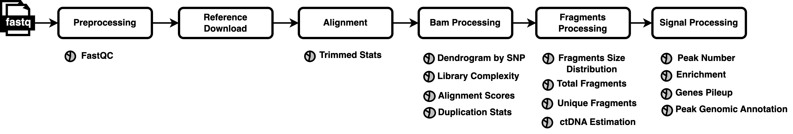

# SNAP
### Streamlined Nextflow Analysis Pipeline for profiling circulating histone modifications identifies tumor epigenomic signatures in cancer plasma.





## SNAP Pipeline Documentation

### Detailed Processing:

```
Preprocessing
├── createSamplesheet
├── fastqc

Reference Download
├── downloadGenome
├── createGenomeIndex
├── fetch_chrom_sizes
├── downloadDACFile
├── downloadSNPRef

Alignment
├── trim
├── align

Bam processing
├── sort_bam
├── filter_properly_paired
├── lib_complex_preseq
├── unique_sam
├── quality_filter
├── dedup
├── createStatsSamtoolsfiltered
├── index_sam
├── createSMaSHFingerPrint

Fragments processing
├── sort_readname_bam
├── createMotifGCfile
├── calcFragsLengthDistribuition
├── fragle_ct_estimation
├── bam_to_bed

Signal processing
├── bam_to_bedgraph
├── bedgraph_to_bigwig
├── igv_reports
├── call_peaks
├── peaks_report
├── peaks_annotations
├── enrichmentReport
├── report_lite
```

## Input Data Options
There are two ways to provide input files to the pipeline:  
1. A **directory** containing the files to be processed.  
2. A **spreadsheet** with basic metadata about the files.  

The input files can be of three types:  
- **FASTA files**  
- **Raw BAM files** (generated immediately after alignment with a reference genome)  
- **Processed BAM files** (expected to be sorted, deduplicated, and filtered for unique reads)  

Below is a detailed explanation of how to use each method.  

---

## Providing Input as FASTA Files
If your sample files are in **FASTA format**, use the `--sample_dir_fasta` parameter. The pipeline assumes that each sample is stored in a separate directory, and all files within that directory belong to the corresponding sample.  

### Example Directory Structure:

```
Sample_folder/
├── Sample1/
│   ├── Sample1_ABC_123_1.fasta
│   ├── Sample1_ABC_123_2.fasta
├── Sample2/
│   ├── Sample2_ABC_123_1.fasta
│   ├── Sample2_ABC_123_2.fasta
├── Sample3/
│   ├── Sample3_ABC_123.fasta
```

### Automatic Spreadsheet Generation
When using this method, the pipeline will generate a **spreadsheet** (`CSV format`) with the following structure: 

sampleId, enrichment_mark, read1, read2, control

- The pipeline supports both **paired-end** and **single-end** FASTA files.
- You can specify which **enrichment mark** should be calculated using the `--enrichment_mark` parameter.

### Enrichment Marks
By default, the SNAP pipeline supports the following enrichment marks:
- **H3K4me3**
- **H3K27ac**
- **MeDIP**

The reference files required for this calculation are stored in:

ref_files/enrichment_states/enrichment_mark/

If you need to provide **custom enrichment mark files**, place the **on-target** and **off-target** BED files in a local directory and name it after the desired histone mark. The expected file names are:
- `off.target.filt.bed`
- `on.target.filt.bed`

Then, set:
- `--enrichment_mark <custom_mark_name>`
- `--enrichment_states_ref <path_to_directory>`

📌 **Note:** If using the **directory-based** input method, all samples will have the **same enrichment mark** applied. If you need to assign different histone marks to individual samples within the same execution, you must provide a **spreadsheet** instead.

---

## Providing Input via Spreadsheet (FASTA)
To provide input using a spreadsheet, use the `--samplesheetfasta` parameter. This expects a **CSV file** with the following structure:

sampleId, enrichment_mark, read1, read2,control

- The **enrichment_mark** field can be left blank if no enrichment mark calculation is required.
- The **read2** field can be left blank for **single-end** FASTA files.
- The **control** field is used when you wanto to indicate which sample is going to be used as a control, in that case you just provide the sampleid of the samples here, if you left blank the samples will have no control sample.

---

## Providing Input as BAM Files
If your data is already aligned (BAM format), you can use one of the following options:
- **Directory-based input:** `--sample_dir_bam`
- **Spreadsheet-based input:** `--samplesheetBams`

### Example Directory Structure for BAM Files:

```
Sample_folder/
│── Sample1/
│   ├── Sample1_ABC_123.bam
│── Sample2/
│   ├── Sample2_ABC_123.bam
│── Sample3/
│   ├── Sample3_ABC_123.bam
```

### Providing Input via Spreadsheet (BAM)
To provide BAM files via a **spreadsheet**, use the `--samplesheetBams` parameter. The expected CSV format is:

sampleId, enrichment_mark, bam

- The **enrichment_mark** field is optional.

📌 **Automatic Spreadsheet Generation:**
Whenever a directory is provided using `--sample_dir_fasta` or `--sample_dir_bam`, the pipeline will generate a **spreadsheet** in the **output directory**. The file will be named:
- `snap-samplesheet-bam-date_and_time.csv`
- `snap-samplesheet-fasta-date_and_time.csv`

---

## Handling Pre-Processed BAM Files
If your BAM files are **already processed** (sorted, deduplicated, and filtered for unique reads), you can **skip redundant processing steps** by setting:

–deduped_bam true

This should be used in combination with either `--samplesheetBams` or `--sample_dir_bam`.

📌 **Skipping Steps:** When `--deduped_bam true` is set, the pipeline will **bypass**:
- BAM sorting
- Library complexity calculation
- Unique read filtering
- Quality filtering
- `samtools` stats calculation
- Duplicate removal

This reduces processing time if your BAM files have already undergone these steps.

---

## Reference Genome Selection
Specify the reference genome version using: 

–genome <reference_genome>

The SNAP pipeline is pre-configured to support:
- **hg19**
- **hg38**

For these references, no additional downloads are required—the necessary FASTA files, **blacklist regions**, and SNP files for sample identification are already available in:
ref_files/genome/genome_paths.csv

If using a **custom reference genome**, provide a **local version** of this file and specify:
- `--genomeInfoPaths <full_path_to_genome_paths.csv>`
- `--genome <custom_genome_name>` (must match the **Genome** field in the CSV file)

---

## Pipeline Execution Phases
The output directory where results will be saved is specified with:
–outputFolder <directory_path>

(Default: `analysis_folder`)

The SNAP pipeline consists of **six main processing stages**. By default, all stages are executed, but you can stop the pipeline at a specific stage using the `--until` parameter:

```
PREPROCESSING
DOWNLOAD_REFERENCES
ALIGNMENT
BAM_PROCESSING
FRAGMENTS_PROCESSING
BAM_SIGNAL_PROCESSING
```
---

## Excluding Blacklisted Genomic Regions
By default, the SNAP pipeline **removes genomic regions known to cause artifacts**, reducing false positives and biases in the analysis.

To **disable** this step, set:

–exclude_dac_regions false

---

## END Motif and GC Content Analysis
The pipeline generates an **END motif analysis file** at:motifs/bp_motif.bed

By default, this analysis considers **4-mers**, but this value can be adjusted using the parameter **--nmer**

---

## Pileup Reports
The SNAP pipeline generates **pileup reports** in two formats:
1. **MultiQC report** (found in `reports/multiqc/`)
2. **IGV session file** (stored in `reports/igv_session/`, viewable in IGV Browser)

By default, both reports use regions defined in: ref_files/pileup_report/test_housekeeping.bed

To use **custom regions**, specify:–genes_pileup_report <path_to_custom_bed_file>

# SNAP Pipeline Output Directory Structure  

After running the SNAP pipeline, the results will be organized into several directories within the output folder which you can provide via the parameter **--outputFolder** (the default value for this parameter is analysis_folder). Each directory stores specific files related to different stages of the pipeline. Below is an explanation of each directory:  

```
output_folder/
├── align/
│   ├── Sample1/
│   ├── Sample2/
├── fastqc/
│   ├── Sample1/
│   ├── Sample2/
├── trim/
│   ├── Sample1/
│   ├── Sample2/
├── frag/
│   ├── Sample1/
│   ├── Sample2/
├── motifs/
│   ├── Sample1/
│   ├── Sample2/
├── peaks/
│   ├── Sample1/
│   ├── Sample2/
├── reports/
│   ├── igv_session/
│   ├── multiqc/
│   ├── SMaSH/
├── snap-samplesheet-fasta-.csv
├── software_versions/
├── stats_files/

```

## Directory Descriptions  

#### `align/`
- Contains subdirectories for each sample (e.g., `Sample1/`, `Sample2/`).
- Stores alignment-related files, including **BAM files**, **index files**

#### `fastqc/`
- Contains subdirectories for each sample, storing **FastQC** quality control reports.
- Each sample will have an associated `.html` report and `.zip` file summarizing sequence quality.

#### `trim/`
- Contains subdirectories for each sample with **trimmed reads** after adapter removal and quality filtering.
- These are the cleaned sequencing reads used for downstream processing.

#### `frag/`
- Contains subdirectories for each sample with fragment length distribution data.
- Useful for downstream analysis such as **nucleosome positioning studies**.

#### `motifs/`
- Contains subdirectories for each sample with motif analysis results.
- Stores **END motif analysis** and **GC content calculations**.
- The file `bp_motif.bed` contains motif information.

#### `peaks/`
- Contains subdirectories for each sample with peak-calling results (if applicable).
- Include **peak files** (`.bed`, `.narrowPeak`, `.bedgraph`, `.bw`, `.control_lambda.bdg`,`.treat_pileup.bdg`,`peaks.xls).

#### `reports/`
- Stores different types of reports generated during the analysis.
- **Subdirectories:**
  - **`igv_session/`** → Contains **IGV session files** for easy visualization of sequencing data in **Integrative Genomics Viewer (IGV)**.
  - **`multiqc/`** → Aggregated **MultiQC report** summarizing quality control metrics.
  - **`SMaSH/`** → A dendogram clustering the samples using SMAsH (https://github.com/rbundschuh/SMaSH) that is also included in the final report.

#### `snap-samplesheet-fasta-<timestamp>.csv`
- The **automatically generated spreadsheet** that summarizes the input samples processed in the pipeline.
- Includes **sample names, enrichment marks, and input file paths**.

#### `software_versions/`
- Stores details about the **versions of software tools** used in the pipeline execution.
- Helps with **reproducibility** and tracking software dependencies.

#### `stats_files/`
- Contains **all the statistics** related to sequencing reads, alignment metrics, and quality filtering.

## Usage Examples

Below are some practical examples showing how to run the SNAP pipeline in different scenarios. These examples aim to help you get started quickly, whether you’re working with FASTA or BAM files, using spreadsheets or directory-based input.

#### `Example 1: Running the pipeline with FASTA files using a spreadsheet/`

In this example, we assume you have sequencing files in compressed FASTA format (.fasta.gz) and a spreadsheet that specifies the location of each read file. Your reference genome is hg19.

You can run the pipeline with the following command:

`nextflow run main.nf -profile docker_light_macos --genome hg19 --outputFolder result_analysis --samplesheetfasta control_sample_sheet.csv`

Explanation of the parameters:

	-profile docker_light_macos** - chooses the appropriate environment profile (in this case, lightweight Docker for macOS)
	--genome hg19 — specifies the reference genome
	--outputFolder result_analysis — sets the output directory
	--samplesheetfasta control_sample_sheet.csv — provides the path to your input spreadsheet (FASTA mode)
 
#### `Example 2: Running the pipeline with FASTA files organized in subdirectories (no spreadsheet)`

In this example, your FASTA files are stored in a root directory (sample_folder), where each sample has its own subdirectory named after the sample, and the corresponding .fasta.gz files are located inside these subdirectories.

If your files follow this structure, you do not need to manually create a sample sheet — the pipeline will generate it automatically.

You can run the pipeline with the following command:

`nextflow run main.nf -profile docker_light_macos --genome hg19 --outputFolder result_analysis --sample_dir_fasta sample_folder`

#### `Example 3: Running the pipeline with raw BAM files (paired-end or single-end)`

In this example, you are working with raw BAM files (i.e., generated directly after alignment) and want to provide them via a directory. The pipeline can process both paired-end (PE) and single-end (SE) BAMs.

By default, the pipeline assumes the reads are paired-end. If your data is single-end, you must explicitly set the parameter --read_method SE.

You can run the pipeline with one of the following commands, depending on your data type:

For paired-end BAM files (default):

`nextflow run main.nf -profile docker_light_macos --genome hg19 --outputFolder result_analysis --sample_dir_bam sample_folder`

For single-end BAM files:

`nextflow run main.nf -profile docker_light_macos --genome hg19 --outputFolder result_analysis --sample_dir_bam sample_folder --read_method SE`

#### `Example 4: Running the pipeline with end motif analysis profile`

This example shows how to run the pipeline specifically to prioritize end motif analysis. A dedicated profile, end_motif_analysis, was created for this purpose.

In this profile: We set -q 0 in Trim Galore, disabling quality-based trimming.
 
This avoids removing biologically meaningful bases at the ends of reads due to low quality scores, which helps preserve true fragment ends — a crucial aspect for reliable motif discovery.

The pipeline also sets --until FRAGMENTS_PROCESSING automatically, stopping the execution right after generating the fragment files, which are used for motif analysis.

 You can run the pipeline with:

 `nextflow run main.nf -profile docker_light_macos,end_motif_analysis --genome hg19 --outputFolder result_analysis --sample_dir_fasta sample_folder`

 Output of interest:

 After execution, motif analysis results will be found in:

 `motifs/<sample_name>/<sample_id>_NMER_bp_motif.bed`
